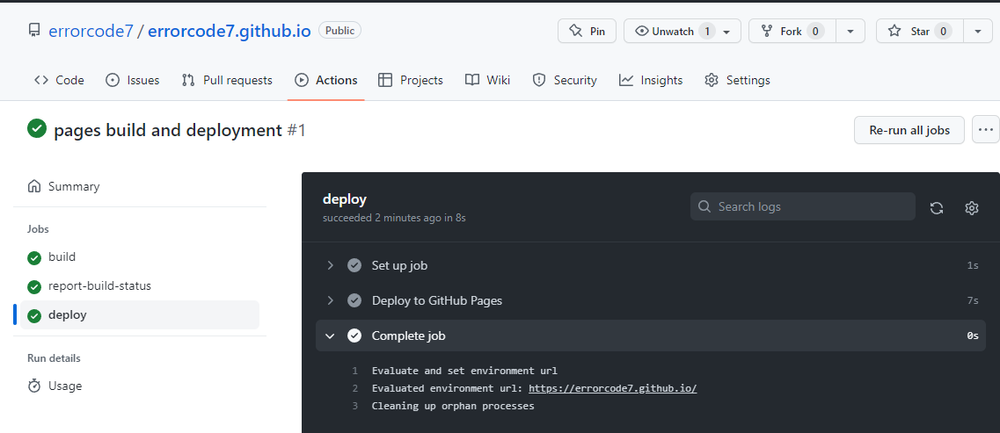
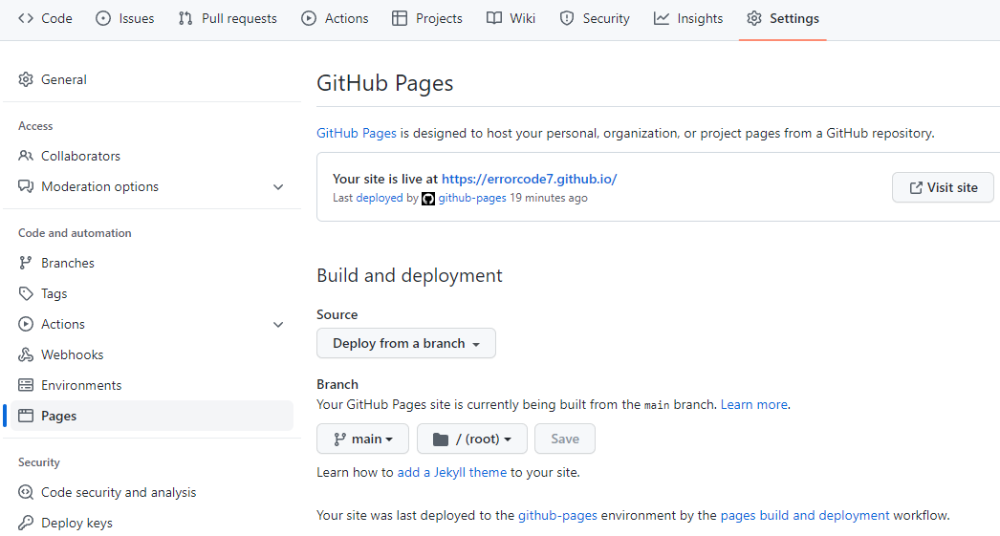

# github pages
[github pages](https://pages.github.com/) 支持静态网页，我们需要把我们渲染后的mdbook上传到github pages仓库。虽然简单粗暴，但有几个完美主义者不能接受的缺点。
- 手动build渲染生成的静态网页再push，diff肯定会很多，看起来不舒服。
- 本地修改的markdown丢失，通过静态网页恢复很麻烦。

因此，我们需要CICD流水线帮助我们build & deploy，我们只管提交md源代码即可。
github的CICD工具很多，当然肯定是他们自亲儿子Actions最好，点击仓库中的Actions选项就能看到流水线。

gitlab里叫pipelines，github叫workflows，我们只需要在当前mdbook工程的 `.github/workflows`下创建yaml格式的流水线控制文件即可。
```shell
mkdir -p .github/workflows 
vim .github/workflows/gh-pages.yml
```
我们新建的`gh-pages.yml`内容：
```yml
name: GitHub Pages Site Build and Deploy workflow
on:
  # 触发流水线的事件，推送或者合并
  push:
    branches:
      - main

  pull_request:
    branches:
      - main
jobs:
  build-and-deploy:
    # 使用构建镜像
    runs-on: ubuntu-latest
    concurrency:
      group: ${{ github.workflow }}-${{ github.ref }}
    
    # clone代码，使用checkout这个action，不带@表示使用最新版本，官方建议带。
    steps:
      - name: Checkout
        uses: actions/checkout@v2
    # 构建代码，相当于使用别人做的mdbook docker
      - name: Build and Deploy
        uses: peaceiris/actions-mdbook@v1
        with:
          mdbook-version: 'latest'
    # 构建代码      
      - run: mdbook build

    # 部署静态页面
      - name: Deploy
        uses: peaceiris/actions-gh-pages@v3
        if: ${{ github.ref == 'refs/heads/main' }}
        with:
          github_token: ${{ secrets.GITHUB_TOKEN }}
          publish_branch: gh-pages
          publish_dir: ./book
```

在提交代码之前需要：

1.创建ssh密钥对

密钥对生成在当前目录下，千万不要在工程目录下创建，否则不小心提交上去就悲剧了。
```shell
cd #切换到用户目录去创建
git config --global user.name yourname
git config --global user.email yourname@gmail.com

ssh-keygen -t rsa -b 4096 -C "$(git config user.email)" -f gh-pages -N ""
```
2.github上创建项目并配置

- 创建项目名称：your-github-name.github.io
- 仓库的Settings里的Deploy Keys项目添加key，`title`为`ACTIONS_DEPLOY_KEY`，`Key`填入公钥文件`gh-pages.pub`的内容，勾选`Allow write access`；
  
  在Secrets下的Actions内添加Secrets，`Name`为`ACTIONS_DEPLOY_KEY`,`Secrets`填入私钥文件`gh-pages`的内容。


3.推送本地项目
```shell
# 初始化当前mdbook工程，并将本地项目的远端设置为新建的git仓库地址
git init . 
git add *
git commit -m "first commit"
git branch -M main
git remote add origin git@github.com:errorcode7/errorcode7.github.io.git
# push前，保证本地.ssh下的公钥已经添加到github账户Settings的SSH keys
git push -u origin main
```
4.检查部署页面

提交成功后点击仓库里的Actions，查看流水线构建情况。

提交代码后会触发构建流水线，生成的静态网页会被自动提交到`gh-pages`分支，触发静态网页部署的流水线，因此每次提交都有两个流水线,源码构建与page部署，其中`pages build and deployment`是部署到github.io的流水线。
<center>
    
    <br>
    <div style="color:orange; border-bottom: 1px solid #d9d9d9;
    display: inline-block;
    color: #999;
    padding: 2px;">流水线</div>
</center>


**注意**：如果页面404，到项目的Settings->Pages下查看Pages站点的来源是那个分支，可以手动切换到`gh-pages`分支，会重新触发Action，要等部署完才生效。

<center>
    
    <br>
    <div style="color:orange; border-bottom: 1px solid #d9d9d9;
    display: inline-block;
    color: #999;
    padding: 2px;">page设置</div>
</center>

当前[pages](http://errorcode7.github.io)工程的仓库地址：<https://github.com/errorcode7/errorcode7.github.io>

>参考：https://github.com/marketplace/actions/mdbook-action