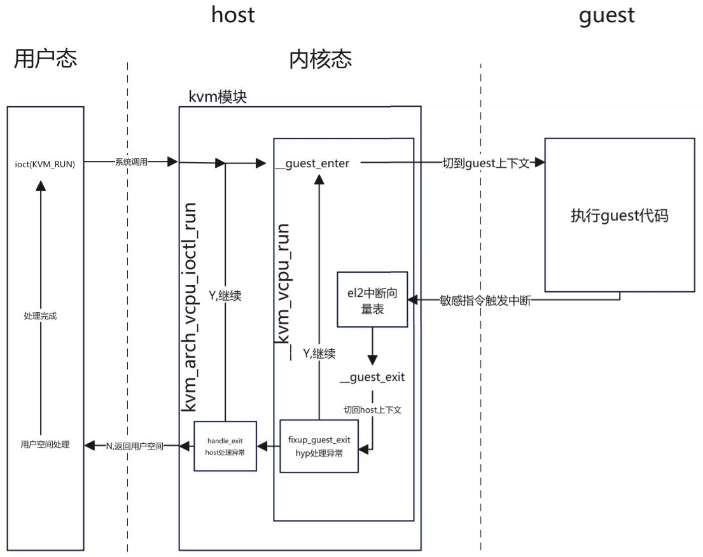

# ARM KVM上下文切换机制分析
---
## 概述

本文档深入分析ARM架构中KVM（Kernel-based Virtual Machine）的上下文切换机制，重点解析`__kvm_vcpu_run_vhe`函数的工作原理和上下文切换的具体实现。本文需要有一定的知识，如中断、系统调用、x86虚拟化、arm异常级别，虚拟地址翻译等。

### 关键概念

- **VHE (Virtualization Host Extension)**：ARMv8.1引入的虚拟化扩展，允许hypervisor在EL2运行
- **Non-VHE**：传统虚拟化模式，hypervisor在EL1，依赖EL2进行虚拟化操作
- **上下文切换**：在host、guest和hypervisor之间切换执行状态的过程
- **阶段2转换**：guest虚拟地址到物理地址的地址转换

### 寄存器分类

在了解上下文切换之前，我们必须先了解寄存器的分类。

| 类别                 | 核心作用           | 典型场景                      | 是否需上下文切换时保存？            |
| -------------------- | ------------------ | ----------------------------- | ----------------------------------- |
| **执行上下文寄存器** | 运行程序的“工作台” | 函数调用、变量存储            | ✅ 必须（Host/Guest 切换）           |
| **系统控制寄存器**   | 配置 CPU“工作模式” | 开启MMU、设置页表、虚拟化陷阱 | ✅ Guest 独有，Host/Guest 切换时保存 |
| **异常状态寄存器**   | 记录“出事时的情况” | 缺页处理、未定义指令捕获      | ❌ 异常处理完即用完，不长期保存      |

#### 执行上下文寄存器（Execution Context Registers）

作用：直接参与程序的指令执行与数据运算，是“代码运行时的现场”。

| 子类       | 寄存器示例       | 说明                                |
| ---------- | ---------------- | ----------------------------------- |
| 通用寄存器 | `x0–x30`         | 存放操作数、地址、函数参数/返回值   |
| 程序计数器 | PC（隐式）       | 指向下一条要执行的指令              |
| 栈指针     | `SP_EL0/1/2`     | 指向当前栈顶，用于函数调用/局部变量 |
| 链接寄存器 | `x30` / `LR_ELx` | 保存函数返回地址                    |

- 被编译器和 ABI 直接使用。
- 用户态和内核态都大量使用。
- 上下文切换（如进程调度、VM-Exit）时**必须完整保存/恢复**。

#### 统控制寄存器（System Control Registers）

作用：配置 CPU 的行为模式，决定“如何执行”而非“执行什么”。它的核心特点是**控制**。

| 功能域    | 寄存器示例                          | 控制内容                                    |
| --------- | ----------------------------------- | ------------------------------------------- |
| 内存管理  | `SCTLR_EL1`, `TTBR0_EL1`, `TCR_EL1` | MMU 开关、页表基址、地址空间布局            |
| 虚拟化    | `HCR_EL2`, `VTTBR_EL2`              | 是否启用 Stage-2 转换、哪些操作 trap 到 EL2 |
| 中断/异常 | `DAIF`（PSTATE）、`ICC_SRE_EL1`     | 屏蔽 IRQ/FIQ/SError、中断路由               |
| 安全扩展  | `SCR_EL3`                           | EL2 是否可用、Secure/Non-secure 切换        |
| 性能/调试 | `PMCR_EL0`, `OSLAR_EL1`             | 性能计数器使能、调试锁                      |

- 通常只在特权级（EL1/EL2/EL3）可写，一般由**操作系统和内核模块**负责修改。
- 修改后影响后续所有指令的执行环境。
- 很多寄存器的某一位是“控制位”，另一些位是“状态位”。

#### 异常与状态保存寄存器（Exception & State-Saving Registers）

作用：在异常发生时自动保存关键状态，用于后续恢复或诊断。它们不用于主动控制 CPU，而是被动反映异常瞬间的状态，影响操作系统的执行逻辑。

| 寄存器     | 作用                                                |
| ---------- | --------------------------------------------------- |
| `ELR_ELx`  | 保存异常发生时的 **PC（返回地址）**                 |
| `SPSR_ELx` | 保存异常发生时的 **PSTATE（含 DAIF、EL、NZCV 等）** |
| `ESR_ELx`  | 记录**异常原因**（如缺页类型、未定义指令）          |
| `FAR_ELx`  | 记录**引发异常的虚拟地址**                          |

- 由硬件在异常入口自动填充。
- 主要供异常处理程序（如内核）读取，用于决定如何响应。
- 通常不可由软件直接用于控制 CPU 行为（只读或写无效）。

### 虚拟化常见寄存器

**虚拟化控制寄存器**

| 寄存器名        | 全称                                           | 功能说明                                    | 关键作用                                                     |
| --------------- | ---------------------------------------------- | ------------------------------------------- | ------------------------------------------------------------ |
| **HCR_EL2**     | Hypervisor Configuration Register              | 控制虚拟化行为的各个方面                    | 通过位设置决定哪些操作（如内存访问、指令执行）会陷阱（trap）到 EL2 |
| **VTTBR_EL2**   | Virtualization Translation Table Base Register | 指向 OS 的二级页表                          | 包含 VMID（虚拟机标识符）和 Stage-2 页表的物理基地址         |
| **VTCR_EL2**    | Virtualization Translation Control Register    | 控制二级地址转换（Stage-2 translation）参数 | 定义 IPA（Intermediate Physical Address）空间大小、页表粒度（如4KB/16KB/64KB）等 |
| **TTBR0/1_EL2** | Translation Table Base Register                | 指向 OS 的一级页表                          | 供mmu实现虚拟地址到物理地址/中间地址的转换                   |

------

**状态与异常处理寄存器**

| 寄存器名      | 全称                                  | 功能说明                            | 关键作用                                                     |
| ------------- | ------------------------------------- | ----------------------------------- | ------------------------------------------------------------ |
| **ESR_EL2**   | Exception Syndrome Register           | 记录异常的详细信息                  | 提供异常类型、指令信息等，用于 EL2 异常处理和调试            |
| **FAR_EL2**   | Fault Address Register                | 记录引发数据/指令访问错误的虚拟地址 | 用于页错误（Page Fault）诊断，指出出错的虚拟地址             |
| **HPFAR_EL2** | Hypervisor IPA Fault Address Register | 记录 Guest 物理地址（IPA）错误      | 在 Stage-2 地址转换失败时，提供出错的 IPA 高位（配合 FAR_EL2 使用） |

---

## 总体架构

先来一张总体流程图，大概描述整个kvm用户空间和内核空间是如何协同工作的。

<center>
    <br>
    
    <br>
    <div style="color:orange; border-bottom: 1px solid #d9d9d9;
    display: inline-block;
    color: #999;
    padding: 2px;">arm-vhe-kvm</div>
</center>


用户空间代码调用ioctl系统调用，触发内核系统kvm对应的函数调用，在内核发生上下文切换，也就是将host运行的指令保存，载入guest的指令到CPU，继续执行PC寄存器的指令。当CPU执行到敏感指令的时候，触发异常，退出guest状态，切换到host上下文，在host内处理捕获到的异常，当处理成功，则继续在切换到guest处理，当处理失败，则错误返回给用户空间处理，用户空间处理完成后继续调用ioctl进入内核，发生上下文切换，执行guest代码。

Q：什么是用户空间代码？作用是什么？

A：qemu这类用户态程序。

- 管理VM和VCPU的生命周期。

- 设备模拟和环境准备，如磁盘，内核文件，固件等；在内核无法处理异常，放到用户空间处理，比如IO，关机，信号、中断注入等。

- 分配虚拟机内存。

Q：什么是上下文切换？如何切换？

A：上下文就是CPU寄存器状态。在x86环境中，有一个数据结构叫做VMCS，两个对象记录host和guest的上下文；在arm环境中，记录上下文用kvm_cpu_context，一个是kvm对象引用的kvm_cpu_context记录guest的上下文，通过perCPU上定义的kvm_cpu_context记录host的上下文。第一次运行的时候，要先准备好guest的上下文。整个原理是我们的核心分析过程，后面将详细描述。

Q：什么是guest和host？

A：host是宿主机执行指令的状态，guest是虚拟机执行指令的状态。当从host切换到guest执行代码的时候，需要在host执行切换相关的代码，设置CPU工作模式，CPU进入guest的工作状态，保存host的寄存器到内存，载入guest的寄存器值到CPU，然后特定的指令来模拟恢复到之前执行状态。guest状态切换到host，反之亦然。

在x86中，host就是vmx root mode，不过没必要去记root和none-root，只需要记住host状态和guest状态。

Q：什么是敏感指令？

A：敏感指令就是CPU虚拟化里定义的，需要特殊关注处理的指令，**不必刻意去区分是否拥有特权**，只需要知道他们特殊罢了。CPU有各种工作模式，当你不开启虚拟化，那么就不会关注敏感指令，当开启虚拟，并通过设置特定寄存器告诉CPU要关注某些敏感指令，一旦CPU处于guest状态，流水线上发现了敏感指令，则触发中断，在中断里模拟指令的实现。

你可以想象一下马里奥踩到特殊地砖，进入到地下执行任务，执行完了后再次回到地上的流程，去地下就是回到host，模拟执行特殊指令。进入到host状态，这个过程叫做VM-exit，进入到guest状态的过程叫做VM-entry。

Q：CPU如何知道当前运行的是guest，需要去拦截敏感指令？

A：CPU寄存器分为控制CPU工作模式的寄存器，状态寄存器，数据寄存器这几类。在CPU切换到guest代码之前，host代码会去操作控制寄存器，让CPU以另外一种工作模式运行，敏感指令就被监控，一旦触发就陷入异常，进入host模拟。

## 关键函数

### 1.  用户空间代码

来源：[Linux虚拟化KVM-Qemu分析（四）之CPU虚拟化（2）](https://www.cnblogs.com/LoyenWang/p/13796537.html)，这份代码模拟qemu的基本工作原理：

- 打开kvm对象，根据kvm对象创建vm对象，根据vm对象创建VCPU。
- 分配用户空间地址，将可执行二进制映射到分配的内存。
- KVM_SET_USER_MEMORY_REGION系统调用，将分配的用户空间地址作为虚拟机的物理内存地址。
- 使用kvm实现的mmap函数，将VCPU内记录运行状态的内存共享到用户空间，方便读取从内核返回到用户空间的原因。
- 设置CPU最初始化的寻址方式，从物理内存的指定位置读取内存。(这是x86的设置方式)。
- 使用KVM_RUN启动VCPU，当系统调用返回的时候读取内核返回的原因，然后在用户空间处理，处理后继续运行VCPU。

```c
#define KVM_DEV     "/dev/kvm"
#define TINY_KERNEL_FILE    "./tiny_kernel.bin"
#define PAGE_SIZE  0x1000
int main(void)
{
    int kvm_fd;
    int vm_fd;
    int vcpu_fd;
    int tiny_kernel_fd;
    int ret;
    int mmap_size;
    
    struct kvm_sregs sregs;
    struct kvm_regs regs;
    struct kvm_userspace_memory_region mem;
    struct kvm_run *kvm_run;
    void *userspace_addr;

    /*打开kvm设备，返回代表kvm的套接字*/
    kvm_fd = open(KVM_DEV, O_RDWR);
    assert(kvm_fd > 0);

    /*创建VM对象 */
    vm_fd = ioctl(kvm_fd, KVM_CREATE_VM, 0);
    assert(vm_fd >= 0);

    /*根据vm对象创建vcpu对象*/
    vcpu_fd = ioctl(vm_fd, KVM_CREATE_VCPU, 0);//kvm_vm_ioctl_create_vcpu在内核创建vcpu对象
    assert(vcpu_fd >= 0);

    /* map 4K into memory */
    userspace_addr = mmap(NULL, PAGE_SIZE, PROT_READ | PROT_WRITE, MAP_SHARED | MAP_ANONYMOUS, -1, 0);
    assert(userspace_addr > 0);
    /* 打开虚拟机将运行的二进制 */

    tiny_kernel_fd = open(TINY_KERNEL_FILE, O_RDONLY);
    assert(tiny_kernel_fd > 0);    
    /* 文件映射到内存 */
    ret = read(tiny_kernel_fd, userspace_addr, PAGE_SIZE);
    assert(ret >= 0);
	/*将二进制映射到内存*/
    
    /*将当前进程分配的虚拟内存，作为虚拟机的物理内存*/
    mem.slot = 0;
    mem.flags = 0;
    mem.guest_phys_addr = 0;
    mem.memory_size = PAGE_SIZE;
    mem.userspace_addr = (unsigned long)userspace_addr;
    
    /*KVM_SET_USER_MEMORY_REGION将虚拟内存作为vm对象的内存，此时VCPU读取物理内存*/
    ret = ioctl(vm_fd, KVM_SET_USER_MEMORY_REGION, &mem);
    assert(ret >= 0);

    /* KVM_GET_VCPU_MMAP_SIZE获取kvm_run地址，这个结构体用于存储运行kvm运行状态，
    	用户空间代码通过这个结构体获取kvm的运行状态
    */
    mmap_size = ioctl(kvm_fd, KVM_GET_VCPU_MMAP_SIZE, NULL);
    assert(mmap_size >= 0);
    //这里很有意思，将vcpu的内存映射到用户空间。
    kvm_run = (struct kvm_run *)mmap(NULL, mmap_size, PROT_READ | PROT_WRITE, MAP_SHARED, vcpu_fd, 0);
    assert(kvm_run >= 0);

    /*sregs包含了x86架构的系统寄存器和段寄存器状态，这些寄存器控制着CPU的核心操作模式
    tiny_kernel.bin预期被加载到物理地址0，并且从16位实模式开始执行。
    */
    ret = ioctl(vcpu_fd, KVM_GET_SREGS, &sregs);
    assert(ret >= 0);
    sregs.cs.base = 0;
    sregs.cs.selector = 0;
    
    ret = ioctl(vcpu_fd, KVM_SET_SREGS, &sregs);
    memset(&regs, 0, sizeof(struct kvm_regs));
    regs.rip = 0;
    ret = ioctl(vcpu_fd, KVM_SET_REGS, &regs);
    assert(ret >= 0);

    /* 指定一个cpu运行，一个CPU对应一个kvm_run结构体 */
    while (1) {
        ret = ioctl(vcpu_fd, KVM_RUN, NULL);
        assert(ret >= 0);

        switch(kvm_run->exit_reason) {
            case KVM_EXIT_HLT:
                printf("----KVM EXIT HLT----\n");
                close(kvm_fd);
                close(tiny_kernel_fd);
                return 0;
            case KVM_EXIT_IO:
                putchar(*(((char *)kvm_run) + kvm_run->io.data_offset));
                break;
            default:
                printf("Unknow exit reason: %d\n", kvm_run->exit_reason);
                break;
        }
    }

    return 0;
}
```


### 2. kvm驱动实现

**关键流程**

```c
kvm_vcpu_ioctl()
    kvm_arch_vcpu_ioctl_run()
        kvm_arm_vcpu_enter_exit()
            kvm_call_hyp_ret(__kvm_vcpu_run, vcpu)
            ├─ VHE模式: __kvm_vcpu_run_vhe() 
            └─ 非VHE模式: __kvm_vcpu_run()
                __guest_enter() (汇编实现)
                   eret (异常返回指令)
```

#### KVM_RUN系统调用入口

ioctl(vcpu_fd, KVM_RUN, NULL)实际调用的对应在内核中的处理逻辑如下：

```c
static long kvm_vcpu_ioctl(struct file *filp,
			   unsigned int ioctl, unsigned long arg)
{
	struct kvm_vcpu *vcpu = filp->private_data;//从套接字对应的filp对象中获取vcpu对象。
	void __user *argp = (void __user *)arg;
	int r;
	struct kvm_fpu *fpu = NULL;
	struct kvm_sregs *kvm_sregs = NULL;

	if (vcpu->kvm->mm != current->mm || vcpu->kvm->vm_dead)
		return -EIO;

	if (unlikely(_IOC_TYPE(ioctl) != KVMIO))
		return -EINVAL;

	/*
	 * Wait for the vCPU to be online before handling the ioctl(), as KVM
	 * assumes the vCPU is reachable via vcpu_array, i.e. may dereference
	 * a NULL pointer if userspace invokes an ioctl() before KVM is ready.
	 */
	r = kvm_wait_for_vcpu_online(vcpu);
	if (r)
		return r;

	/*
	 * Some architectures have vcpu ioctls that are asynchronous to vcpu
	 * execution; mutex_lock() would break them.
	 */
	r = kvm_arch_vcpu_async_ioctl(filp, ioctl, arg);
	if (r != -ENOIOCTLCMD)
		return r;

	if (mutex_lock_killable(&vcpu->mutex))
		return -EINTR;
	switch (ioctl) {
	case KVM_RUN: {
	case KVM_RUN: {
		struct pid *oldpid;
		r = -EINVAL;
		if (arg)
			goto out;

		/*
		 * Note, vcpu->pid is primarily protected by vcpu->mutex. The
		 * dedicated r/w lock allows other tasks, e.g. other vCPUs, to
		 * read vcpu->pid while this vCPU is in KVM_RUN, e.g. to yield
		 * directly to this vCPU
		 */
		oldpid = vcpu->pid;
		if (unlikely(oldpid != task_pid(current))) {
			/* The thread running this VCPU changed. */
			struct pid *newpid;
			//第一次执行的时候，实现VCPU初始化，属于延迟初始化的优化
			r = kvm_arch_vcpu_run_pid_change(vcpu);
			if (r)
				break;

			newpid = get_task_pid(current, PIDTYPE_PID);
			write_lock(&vcpu->pid_lock);
			vcpu->pid = newpid;
			write_unlock(&vcpu->pid_lock);

			put_pid(oldpid);
		}//更新vcpu记录当前的线程PID
		vcpu->wants_to_run = !READ_ONCE(vcpu->run->immediate_exit__unsafe);
		r = kvm_arch_vcpu_ioctl_run(vcpu);//关键入口，返回整数r,错误原因
		vcpu->wants_to_run = false;

		trace_kvm_userspace_exit(vcpu->run->exit_reason, r);
		break;
	}
...
}     

```

####  VHE模式

这里根据 has_vhe()判断是否启用了VHE，决定使用哪种调用。

- 在非VHE模式模式中，kvm_call_hyp_ret() 宏走kvm_call_hyp_nvhe路径，调用arm_smccc_1_1_hvc，会触发一个 HVC 指令，把当前正在运行在内核中EL1状态的 CPU陷入 EL2，才能执行host和guest的上下文切换，进入到guest的。也就是说，在内核中的**kvm模块需要再次陷入**到更高的异常级别才能操作硬件资源。
- VHE模式中，Linux 内核本身就在 EL2 运行，所以直接调用 f() 同样是在 EL2 中，不用陷入到EL2。

```c
#ifndef __KVM_NVHE_HYPERVISOR__
#define kvm_call_hyp_nvhe(f, ...)						\
	({								\
		struct arm_smccc_res res;				\
									\
		arm_smccc_1_1_hvc(KVM_HOST_SMCCC_FUNC(f),		\
				  ##__VA_ARGS__, &res);			\
		WARN_ON(res.a0 != SMCCC_RET_SUCCESS);			\
									\
		res.a1;							\
	})

/*
 * The isb() below is there to guarantee the same behaviour on VHE as on !VHE,
 * where the eret to EL1 acts as a context synchronization event.
 */
#define kvm_call_hyp(f, ...)						\
	do {								\
		if (has_vhe()) {					\
			f(__VA_ARGS__);					\
			isb();						\
		} else {						\
			kvm_call_hyp_nvhe(f, ##__VA_ARGS__);		\
		}							\
	} while(0)

#define kvm_call_hyp_ret(f, ...)					\
	({								\
		typeof(f(__VA_ARGS__)) ret;				\
									\
		if (has_vhe()) {					\
			ret = f(__VA_ARGS__);				\
		} else {						\
			ret = kvm_call_hyp_nvhe(f, ##__VA_ARGS__);	\
		}							\
									\
		ret;							\
	})
#else /* __KVM_NVHE_HYPERVISOR__ */
#define kvm_call_hyp(f, ...) f(__VA_ARGS__)
#define kvm_call_hyp_ret(f, ...) f(__VA_ARGS__)
#define kvm_call_hyp_nvhe(f, ...) f(__VA_ARGS__)
```

在之前的arm规范中，严格区分了内核代码运行在EL1和hypervisor运行在EL2，也就是nVHE模式的kvm实现。

- 当用户触发kvm系统调用的时候，要先触发EL1级别的内核调用，再通过HVC 指令进入EL2级别的hypervisor调用，进入到guest代码运行。

- 同样，guest代码运行的时候访问io资源，guest处于el1的状态，执行的敏感指令被拦截，陷入到EL2级里的kvm执行，在EL2内的kvm只能处理简单的异常，大部分异常需要用户态模拟，因此再返回到EL1的内核态的kvm模块处理，在EL1内核态再返回给用户。

- 用户态处理完后还要通过系统调用，先进入host内核，继续通过EL2陷入，才能恢复guest代码的执行。

忽略用户态的处理部分，nVHE模式的hypervisor处理流程。大致逻辑：EL1 -> EL2 -> EL1(主机内核) -> EL2 -> EL1(Guest)。


为了减少这么多步骤的异常级切换，直接让hypervisor和内核工作在一个异常级别即可。ARMv8.1 通过以下机制，使得内核运行在 EL2 ：
HCR_EL2.E2H = 1（Enable EL2 Host）,    当此位为 1 时，EL2 的行为被“重塑”：

- 访问 TTBR0_EL1 实际操作的是 TTBR0_EL2，也就是说，之前的内核代码不用修改访问寄存器的指令，就可以访问TTBR0_EL2(页表寄存器)。
-  SPSR_EL1、ELR_EL1 等寄存器在 EL2 中可用
- 系统调用（SVC）可以从 EL0 直接陷入 EL2（而非 EL1）

	效果：EL2 可以运行一个完整的操作系统内核（如 Linux），就像它在 EL1 一样！

HCR_EL2.TGE = 1（Trap General Exceptions）

- 配合 E2H，使 EL0 的异常（如 SVC、IRQ）直接路由到 EL2。

Stage-1 页表支持

- 即使在 EL2，也可以使用自己的 Stage-1 页表（通过 TTBR0_EL2 / TTBR1_EL2），实现虚拟地址空间。

- 但 Linux 内核严重依赖虚拟内存（`vmalloc`, `slab`, 用户态映射等）。

| 机制               | 解决的问题              | 实现效果                                      |
| ------------------ | ----------------------- | --------------------------------------------- |
| **`E2H=1`**        | EL2 无法使用 EL1 寄存器 | **寄存器别名映射**，Linux 代码无需修改        |
| **`TGE=1`**        | EL0 异常无法路由到 EL2  | **异常直接陷入 EL2**，Host 能处理 syscall/IRQ |
| **Stage-1 in EL2** | EL2 无虚拟内存支持      | **完整虚拟地址空间**，支持现代 OS 内存管理    |

最终，本质上kvm和内核都工作在EL2，host上只有EL0和EL2，根x86差不多。
<center>
    
    <br>
    <div style="color:orange; border-bottom: 1px solid #d9d9d9;
    display: inline-block;
    color: #999;
    padding: 2px;">nvhe-vs-vhe</div>
</center>


---

####  ARM KVM上下文切换实现


#### __kvm_vcpu_run_vhe函数

在寄存器分类中，我们知道分为执行上下文，系统控制，异常状态这几类，所有进入上下文切换之前，需要：

- 保存一些host的CPU运行状态
- 设置CPU进入虚拟化执行的工作模式
- 恢复恢复guest的CPU运行状态，有了运行状态，guest在el1的系统就有了运行逻辑的参考依据，一旦切换执行上下文成功，比如栈寄存器和PC寄存器就位，马上就可以开始有条不紊的工作。

arm PC寄存器不能直接填入将指令的地址，需要将地址放入ELR_ELx，当执行 `ret` 的时候，ELR_ELx的值被自动弹入到PC，SPSR_ELx弹入到PSTATE，切换到 `SPSR_ELx` 指定的异常级别开始取指运行。也就是进入到guest的el1的内核态开始执行。

```c
/* Switch to the guest for VHE systems running in EL2 */
static int __kvm_vcpu_run_vhe(struct kvm_vcpu *vcpu)
{
	struct kvm_cpu_context *host_ctxt;
	struct kvm_cpu_context *guest_ctxt;
	u64 exit_code;

	host_ctxt = host_data_ptr(host_ctxt);
	guest_ctxt = &vcpu->arch.ctxt;

	fpsimd_lazy_switch_to_guest(vcpu);

	sysreg_save_host_state_vhe(host_ctxt);

	/*
	 * Note that ARM erratum 1165522 requires us to configure both stage 1
	 * and stage 2 translation for the guest context before we clear
	 * HCR_EL2.TGE. The stage 1 and stage 2 guest context has already been
	 * loaded on the CPU in kvm_vcpu_load_vhe().
	 */
	__activate_traps(vcpu);//设置捕获敏感指令，x86是通过vmcs里的字段控制，由特定指令载入寄存器。

	__kvm_adjust_pc(vcpu);
	//Guest 关键寄存器（如 ELR_EL2）设置放在 C 层,__guest_enter汇编只负责上下文切换。
	sysreg_restore_guest_state_vhe(guest_ctxt);//设置guest的PC寄存器值elr寄存器，方便eret

	do {
		/* Jump in the fire! */
		exit_code = __guest_enter(vcpu);//这里bl__guest_enter，lr寄存器记录返回地址。最终__guest_exit执行ret，返回exit_code

		/* And we're baaack! */
	} while (fixup_guest_exit(vcpu, &exit_code));//如果可以在el2快速处理就直接处理，不能则回到用户空间。

	sysreg_save_guest_state_vhe(guest_ctxt);

	__deactivate_traps(vcpu);

	sysreg_restore_host_state_vhe(host_ctxt);

	/*
	 * Ensure that all system register writes above have taken effect
	 * before returning to the host. In VHE mode, CPTR traps for
	 * FPSIMD/SVE/SME also apply to EL2, so FPSIMD/SVE/SME state must be
	 * manipulated after the ISB.
	 */
	isb();
	...
	return exit_code;
}
NOKPROBE_SYMBOL(__kvm_vcpu_run_vhe);

//sysreg-sr.c  
void sysreg_restore_guest_state_vhe(struct kvm_cpu_context *ctxt) {
    __sysreg_restore_common_state(ctxt);
    __sysreg_restore_el2_return_state(ctxt);
}    
//sysreg-sr.h：
static inline void __sysreg_restore_el2_return_state(struct kvm_cpu_context *ctxt) {
    // ...
    write_sysreg_el2(ctxt->regs.pc, SYS_ELR);//将PC值写入elr寄存器，方便eret
    write_sysreg_el2(pstate, SYS_SPSR);
}
```

#### __guest_enter汇编入口

__guest_enter的实现：

- 保存host上下文到kvm_hyp_ctxt，包括处于el2运行级别的通用寄存器和el0级的host用户栈sp_el0。

- 恢复guest上下文，处于el1运行级别的通用寄存器和el0级的guest用户栈sp_el0。

- eret跳转到guest的PC寄存器，开始执行。

	```c
	// Restore guest regs x0-x17,
	// Restore guest regs x18-x29和lr
	恢复上下文这里，为啥分成两段写，我觉得优点奇怪。
	```

guest代码执行到敏感指令，触发异常，从guest的el1陷入到host的el2，进入el2_sync向量，这是一段垫片代码，最终执行到__guest_exit，将perCPU变量上保存的vcpu地址作为参数。

__guest_exit的实现：

- 从vcpu获取kvm_cpu_context对象（vcpu->kvm_cpu_context）。将guest上下文保存到kvm_cpu_context对象，guest的通用寄存器和sp_el0。
- 将从percpu获取kvm_hyp_ctxt对象，恢复host上下文，sp_el0和通用寄存器（当然包括lr/x30寄存器）。
- ret 跳转到__guest_enter的下一条指令。

```asm
// arch/arm64/kvm/hyp/hyp-entry.S

el2_sync:
	/* Check for illegal exception return */
	mrs	x0, spsr_el2//读取到x0，spsr_el2记录了异常发生前的 PSTATE（如异常级、条件码、中断屏蔽等）
	tbnz	x0, #20, 1f //如果 SPSR_EL2 的 SS 位为 1，说明这是一个非法的 ERET 异常，就跳转到标签 1 处进行特殊处理。

	save_caller_saved_regs_vect //保存所有调用者保存的寄存器到堆栈上
	stp     x29, x30, [sp, #-16]! //将帧指针 x29 和链接寄存器 x30 压栈。这是在为调用 C 函数准备标准的堆栈帧。
	bl	kvm_unexpected_el2_exception //进入异常处理
	ldp     x29, x30, [sp], #16
	restore_caller_saved_regs_vect

	eret

1:
	/* Let's attempt a recovery from the illegal exception return */
	get_vcpu_ptr	x1, x0 //获取percpu上保存的vcpu传入给__guest_exit
	mov	x0, #ARM_EXCEPTION_IL
	b	__guest_exit

el1_sync:  // 同步异常（如 Data Abort）
    ...
	b.ne	el1_trap
el1_trap:
	get_vcpu_ptr	x1, x0
	mov	x0, #ARM_EXCEPTION_TRAP
	b	__guest_exit

//u64 __guest_enter(struct kvm_vcpu *vcpu);
SYM_FUNC_START(__guest_enter)
	// x0: vcpu，又是返回值
	// x1-x17: clobbered by macros
	// x29: guest context
    // x2 辅助计算。
	adr_this_cpu x1, kvm_hyp_ctxt, x2 //从cpu上获取 kvm_cpu_context对象的地址

	// Store the hyp regs
	save_callee_saved_regs x1//将当前(调用者)x18-x30的寄存器保存到上下文。

	// Save hyp's sp_el0
	save_sp_el0	x1, x2 //将用户空间栈sp_el0保存到kvm_hyp_ctxt上下文。在进入__guest_enter前，都是执行Hypervisor的C代码，先系统调用，。
    //将host的上下文记录完。

	// Now the hyp state is stored if we have a pending RAS SError it must
	// affect the host or hyp. If any asynchronous exception is pending we
	// defer the guest entry. The DSB isn't necessary before v8.2 as any
	// SError would be fatal.
alternative_if ARM64_HAS_RAS_EXTN
	dsb	nshst
	isb
alternative_else_nop_endif
	mrs	x1, isr_el1
	cbz	x1,  1f
	mov	x0, #ARM_EXCEPTION_IRQ
	ret
1:
	set_loaded_vcpu x0, x1, x2

	add	x29, x0, #VCPU_CONTEXT，取x0的偏移赋值给x29,x29=vcpu->kvm_cpu_context

	// mte_switch_to_guest(g_ctxt, h_ctxt, tmp1)
	mte_switch_to_guest x29, x1, x2

	// Macro ptrauth_switch_to_guest format:
	// 	ptrauth_switch_to_guest(guest cxt, tmp1, tmp2, tmp3)
	// The below macro to restore guest keys is not implemented in C code
	// as it may cause Pointer Authentication key signing mismatch errors
	// when this feature is enabled for kernel code.
	ptrauth_switch_to_guest x29, x0, x1, x2

	// Restore the guest's sp_el0
	restore_sp_el0 x29, x0//将vcpu的sp_el0恢复到sp_el0，用户栈

	// Restore guest regs x0-x17,从x29的偏移取一对数据。
	ldp	x0, x1,   [x29, #CPU_XREG_OFFSET(0)]
	ldp	x2, x3,   [x29, #CPU_XREG_OFFSET(2)]
	ldp	x4, x5,   [x29, #CPU_XREG_OFFSET(4)]
	ldp	x6, x7,   [x29, #CPU_XREG_OFFSET(6)]
	ldp	x8, x9,   [x29, #CPU_XREG_OFFSET(8)]
	ldp	x10, x11, [x29, #CPU_XREG_OFFSET(10)]
	ldp	x12, x13, [x29, #CPU_XREG_OFFSET(12)]
	ldp	x14, x15, [x29, #CPU_XREG_OFFSET(14)]
	ldp	x16, x17, [x29, #CPU_XREG_OFFSET(16)]

	// Restore guest regs x18-x29和lr
	restore_callee_saved_regs x29 //从vcpu恢复lr
	//为什么elr_el2不在这里恢复？要在sysreg_restore_guest_state_vhe
	
	// Do not touch any register after this!
	eret	//这里跳转到elr_el2，也就是VCPU的PC,进入guest代码执行
/*
用户空间（EL0）通过 ioctl 进入 KVM 内核代码（EL1）。
内核代码（EL1）最终调用 __kvm_vcpu_run，准备好上下文后，通过 SMC/HVC 或跳转机制切换到 EL2。
在 EL2 下，执行 __guest_enter，完成虚拟机上下文切换，eret 进入 Guest（EL1/EL0）。
*/
	sb 
	
/*sb 指令是 ARMv8 架构中的 “Speculation Barrier”（推测屏障）指令。
作用：
用于防止 CPU 执行推测性指令带来的安全隐患（如 Spectre 类漏洞）。
它会阻止指令流中在 sb 之前的所有内存访问被推测性地重排序到 sb 之后。
确保异常返回前后的执行环境不会被推测执行影响，提升安全性。
*/


// arch/arm64/kvm/hyp/entry.S
SYM_INNER_LABEL(__guest_exit, SYM_L_GLOBAL)
	// x0: return code
	// x1: vcpu
	// x2-x29,lr: vcpu regs
	// vcpu x0-x1 on the stack
0
	add	x1, x1, #VCPU_CONTEXT//x1指向vcpu的vcpu_context

	ALTERNATIVE(nop, SET_PSTATE_PAN(1), ARM64_HAS_PAN, CONFIG_ARM64_PAN)

	// Store the guest regs x2 and x3
	stp	x2, x3,   [x1, #CPU_XREG_OFFSET(2)]

	// Retrieve the guest regs x0-x1 from the stack
	ldp	x2, x3, [sp], #16	// x0, x1

	// Store the guest regs x0-x1 and x4-x17
	stp	x2, x3,   [x1, #CPU_XREG_OFFSET(0)]
	stp	x4, x5,   [x1, #CPU_XREG_OFFSET(4)]
	stp	x6, x7,   [x1, #CPU_XREG_OFFSET(6)]
	stp	x8, x9,   [x1, #CPU_XREG_OFFSET(8)]
	stp	x10, x11, [x1, #CPU_XREG_OFFSET(10)]
	stp	x12, x13, [x1, #CPU_XREG_OFFSET(12)]
	stp	x14, x15, [x1, #CPU_XREG_OFFSET(14)]
	stp	x16, x17, [x1, #CPU_XREG_OFFSET(16)]
//依次将 x0-x17 的值保存到 vcpu 的上下文结构体（VCPU_CONTEXT）对应偏移。
//这样做保证异常发生时，Guest 的所有通用寄存器都能被 Hypervisor 完整保存。
	// Store the guest regs x18-x29, lr
	save_callee_saved_regs x1

	// Store the guest's sp_el0
	save_sp_el0	x1, x2
//先保存vcpu上下文，在加载percpu绑定的变量上面的host cpu上下文，这个上下文是切换到guest前保存的。
	adr_this_cpu x2, kvm_hyp_ctxt, x3 //load cpu上找到切换前的上下文到x2，切换前是cpu上下文是Hypervisor的代码。

	// Macro ptrauth_switch_to_hyp format:
	// 	ptrauth_switch_to_hyp(guest cxt, host cxt, tmp1, tmp2, tmp3)
	// The below macro to save/restore keys is not implemented in C code
	// as it may cause Pointer Authentication key signing mismatch errors
	// when this feature is enabled for kernel code.
	ptrauth_switch_to_hyp x1, x2, x3, x4, x5

	// mte_switch_to_hyp(g_ctxt, h_ctxt, reg1)
	mte_switch_to_hyp x1, x2, x3

	// Restore hyp's sp_el0
	restore_sp_el0 x2, x3 //从x2里恢复sp_el0，hyp的C代码执行环境。
/*
ARM64的sp_el0与sp_el2
sp_el0：EL2（Hypervisor）模式下用于存放“EL0/EL1 guest”上下文的备用栈指针。KVM在EL2运行时，sp_el0通常被用作KVM自己的栈（即hyp栈）。
sp_el2：EL2当前正在执行的栈指针。异常陷入EL2时，CPU自动切换sp到sp_el2。
2. KVM上下文切换的栈指针管理
当从guest（EL1）陷入到hyp（EL2）时，CPU自动切换到sp_el2，KVM的异常入口代码（如entry.S）会用sp_el2作为当前栈。
但KVM的很多管理操作（如保存/恢复上下文、调度等）需要自己的“安全栈”，这就是sp_el0的作用。KVM会在进入EL2后，主动切换到自己的hyp栈（sp_el0），以避免和guest/host栈混淆。

vcpu->arch.ctxt.sp 保存 Guest 的 SP_EL0
kvm_hyp_ctxt.sp（per-CPU）保存 Host 的 SP_EL0，也就是qemu的栈。
*/
	// Now restore the hyp regs
	restore_callee_saved_regs x2 //从x2对象里恢复寄存器，包括lr。

	set_loaded_vcpu xzr, x2, x3

alternative_if ARM64_HAS_RAS_EXTN
	// If we have the RAS extensions we can consume a pending error
	// without an unmask-SError and isb. The ESB-instruction consumed any
	// pending guest error when we took the exception from the guest.
	mrs_s	x2, SYS_DISR_EL1
	str	x2, [x1, #(VCPU_FAULT_DISR - VCPU_CONTEXT)]
	cbz	x2, 1f
	msr_s	SYS_DISR_EL1, xzr
	orr	x0, x0, #(1<<ARM_EXIT_WITH_SERROR_BIT)
1:	ret
/*__guest_exit直接的返回值就是__guest_enter一次guest的返回值*/

```

整体来看，可以把__guest_enter看做一个执行上下文切换并运行guest代码的函数。

save_sp_el0保存这里我不太理解。当开启hve的时候，内核处于el2，QEMU进程执行: ioctl(vcpu_fd, KVM_RUN, NULL)的时候，sp_el0指向用户栈 ，但是进入到ioctl系统调用，难道不会保存sp_el0到EL2所在的内核栈吗？如何__guest_enter不保存sp_el0，则切换到guest执行的时候，直接覆盖sp_el0。当再次出现异常进入el2处理，此时在el2内又不需要sp_el0，为什么要去恢复呢？如果不恢复，el2处理异常成功，继续__guest_enter载入guest的sp_el0，如果处理失败，系统调用返回，此时sp_el0将被系统调用恢复。这个逻辑有问题吗？

---

### 3. Stage-2 地址翻译

host和guest上下文切换属于CPU虚拟化的知识范畴，stage-2地址翻译属于内存虚拟化的范畴，但是这两者紧密相关。所有在这里会简单的做一些介绍。

当CPU切换到guest后，从PC寄存器保存的地址取指运行，就涉及到度内存的访问。

在host用户空间分配的虚拟地址，作为虚拟机的物理地址，CPU是如何读取上面的数据并执行的呢？

```c
// QEMU
ioctl(fd, KVM_CREATE_VM, type)；//最终会调用kvm_init_stage2_mmu创建页表。
void *ram = mmap(NULL, 0x1000000, PROT_READ|PROT_WRITE, MAP_PRIVATE|MAP_ANONYMOUS, -1, 0);
// ram = 0x7f1234560000 (Host userspace VA)，host用户空间分配的地址。

// 告诉 KVM：Guest 的 0x0 ~ 0x1000000 是 RAM
kvm_userspace_memory_region reg = {
    .guest_phys_addr = 0x0,
    .memory_size     = 0x1000000,
    .userspace_addr  = (uint64_t)ram,
};
ioctl(vm_fd, KVM_SET_USER_MEMORY_REGION, &reg);
// 此时 Host 物理页尚未分配（可能还在 swap 或 zero page）
```

kvm对象创建的时候，就会给S2页表对象创建，**保证VTTBR_EL2不为空。**

此时，我们将ELR_EL2 = 0x0，SCTLR_EL1.M = 0（关闭MMU，不启用S1翻译，所有不用判段地址是高还是低，不适用TTBR0_EL1/TTBR1_EL1），执行eret的时候，PC寄存器开始从0x0的物理虚拟物理地址开始读取。

```c
PC = 0x0 (VA)
  ↓
Stage-1 （SCTLR_EL1.M=0，，通常 MMU 关闭，假设 Guest 尚未设置页表，如刚启动），
  → 不翻译。（不使用 Guest TTBR0_EL1/TTBR1_EL1 ）
  → 此时 VA = IPA = 0x0
  ↓
Stage-2 （HCR_EL2.VM = 1，开启翻译）
  → 部件TLB未命中 → 页表walk发现PTE无效 → 触发Stage-2 Translation Fault → Trap到kvm EL2处理缺页。→ __guest_exit退出
    ...->直到kvm_arch_vcpu_ioctl_run->
        ->handle_exit->handle_trap_exceptions（处理ESR_ELx_EC_IABT_LOW异常）
        	->...->user_mem_abort（处理内存错误）->kvm_pgtable_stage2_map（实现填充页表项，刷新页表缓存）//在el2内处理完后handle_exit返回。
        ->kvm_arm_vcpu_enter_exit -> ...->__guest_enter //根据handle_exit返回值，决定继续进入guest执行。
  → IPA 0x0 已被你映射到 Host 的 ram 物理页（使用VTTBR_EL2页表寄存器）
  → 再次访问IPA=0x0，得到真实 PA
  ↓
从该物理页读取指令 → 成功！
```

如果开启Stage-1翻译，相当于KVM_SET_USER_MEMORY_REGION提供了物理地址(IPA)给guest EL1内核，guest内核负责管理物理内存，以及创建Stage-1的页表，就是内核正常的初始化物理内存的过程。guest的虚拟地址，都是要通过其 EL1内核分配。

## 关键数据结构和寄存器

```text
kvm (虚拟机实例)
├── 内存管理
│   ├── kvm_memslots[] (内存插槽)
│   └── mmu_lock (MMU锁)
├── vCPU数组
│   └── kvm_vcpu[] (虚拟CPU)
│       ├── 用户空间接口
│       │   └── kvm_run (通信接口)
│       └── 架构特定状态
│           └── kvm_vcpu_arch
│               ├── CPU上下文
│               │   └── kvm_cpu_context
│               │       ├── regs (通用寄存器)
│               │       ├── fp_regs (FP/SIMD寄存器)
│               │       └── sys_regs (系统寄存器)
│               ├── 地址转换
│               │   └── kvm_s2_mmu *hw_mmu
│               │       ├── vmid (虚拟机ID)
│               │       ├── pgd_phys (页表物理地址)
│               │       └── pgt (页表结构)
│               ├── 虚拟外设
│               │   ├── vgic_cpu (虚拟中断控制器)
│               │   ├── timer (虚拟定时器)
│               │   └── pmu (性能监控单元)
│               └── 嵌套虚拟化
│                   └── *nested_mmus
└── 架构特定数据
    └── kvm_arch

Per-CPU Host状态
└── kvm_host_data[]
    └── host_ctxt (Host CPU上下文)
        ├── regs (Host寄存器)
        ├── fp_regs (Host FP状态)
        └── sys_regs (Host系统寄存器)
```

### 1. kvm - 虚拟机实例

**文件位置**: `include/linux/kvm_host.h`

**关键字段**：

```c
struct kvm {
#ifdef KVM_HAVE_MMU_RWLOCK
    rwlock_t mmu_lock;
#else
    spinlock_t mmu_lock;
#endif
    struct mutex slots_lock;
    struct mutex slots_arch_lock;
    struct mm_struct *mm;               // 用户空间内存描述符
    unsigned long nr_memslot_pages;
    struct kvm_memslots __memslots[KVM_MAX_NR_ADDRESS_SPACES][2]; // 内存插槽
    struct kvm_vcpu *vcpus[KVM_MAX_VCPUS]; // vCPU数组
    struct kvm_arch arch;               // 架构特定数据
    atomic_t online_vcpus;             // 在线vCPU计数
    long vcpus_in_guest;                // 在guest中的vCPU数
};
```

**主要作用**：

- 代表一个完整的虚拟机实例
- 管理虚拟机的内存、设备和vCPU
- 提供虚拟机级别的配置和控制

### 2. kvm_vcpu - 虚拟CPU核心结构体

```c
struct kvm_vcpu {
    struct kvm *kvm;                    // 所属虚拟机实例
    int cpu, vcpu_id, vcpu_idx;         // 物理CPU映射和虚拟ID
    struct kvm_run *run;                // 用户空间通信结构
    struct kvm_vcpu_arch arch;          // 架构特定状态
    struct kvm_vcpu_stat stat;          // 统计信息
    int mode;                           // 执行模式(IN_GUEST_MODE等)
    bool wants_to_run;                  // 运行意愿标记
    int preempted;                      // 抢占状态
    void *guest_debug;                  // 调试支持
};
```

**主要作用**：

- 代表一个虚拟CPU实例，是虚拟化的基本单位
- 管理vCPU的生命周期和调度
- 协调guest和host之间的状态切换
- 提供统计信息跟踪和性能监控

### 3. kvm_run - 用户空间通信接口

**文件位置**: `include/uapi/linux/kvm.h`

**主要作用**：

- 作为用户空间和内核空间KVM的通信桥梁
- 传递guest退出原因和处理请求
- 提供同步接口和数据交换

**关键字段**：

```c
struct kvm_run {
    __u8 request_interrupt_window;      // 请求中断窗口
    __u8 immediate_exit;                // 立即退出标记
    __u8 padding1[6];
    __u32 exit_reason;                  // 退出原因
    __u8 ready_for_interrupt_injection; // 中断注入准备状态
    __u8 if_flag;                       // 中断标志
    __u16 flags;                        // 状态标志
    __u64 cr8;                          // x86 CR8寄存器
    __u64 apic_base;                    // APIC基地址
    // 架构特定的退出信息联合体
};
```

### 4. kvm_vcpu_arch - ARM架构特定的vCPU状态

**文件位置**: `arch/arm64/include/asm/kvm_host.h`

**主要作用**：

- 存储ARM架构特定的vCPU完整状态
- 包含guest的处理器上下文和虚拟化配置
- 管理ARM特定的虚拟化特性

**关键字段**：

```c
struct kvm_vcpu_arch {
    struct kvm_cpu_context ctxt;        // CPU上下文(核心)
    void *sve_state;                    // SVE(可伸缩向量扩展)状态
    enum fp_type fp_type;               // 浮点类型
    struct kvm_s2_mmu *hw_mmu;          // 二级地址转换MMU
    u64 hcr_el2, hcrx_el2, mdcr_el2;    // 虚拟化控制寄存器
    struct kvm_vcpu_fault_info fault;  // 缺页错误信息
    struct vgic_cpu vgic_cpu;           // 虚拟GIC状态
    struct kvm_timer timer;             // 虚拟定时器
    struct kvm_pmu pmu;                 // 性能监控单元
    u64 trfcr_while_in_guest;          // 跟踪过滤器配置
    struct kvm_s2_mmu mmu;              // 二级MMU
    struct kvm_s2_mmu *nested_mmus;     // 嵌套虚拟化MMU
};
```

**关键特性**：

- `ctxt`字段是上下文切换的核心
- `hw_mmu`指向实际使用的地址转换结构
- 支持嵌套虚拟化(nested_mmus)
- 包含完整的虚拟外设状态(GIC、定时器、PMU)

### 5. kvm_cpu_context - CPU上下文状态

**文件位置**: `arch/arm64/include/asm/kvm_host.h`

**主要作用**：

- 存储完整的CPU寄存器状态
- 在上下文切换时保存和恢复处理器状态
- 作为guest和host状态切换的载体

**关键字段**：

```c
struct kvm_cpu_context {
    struct user_pt_regs regs;           // 通用寄存器(x0-x30, sp, pc)
    u64 spsr_abt, spsr_und, spsr_irq, spsr_fiq;  // 异常状态寄存器
    struct user_fpsimd_state fp_regs;   // FP/SIMD寄存器
    u64 sys_regs[NR_SYS_REGS];          // 系统寄存器
    struct kvm_vcpu *__hyp_running_vcpu; // hypervisor运行中的vCPU
    u64 *vncr_array;                    // 嵌套虚拟化寄存器
};
```

**寄存器组分类**：

1. **通用寄存器** (regs): x0-x30, sp, pc
2. **异常状态寄存器**: SPSR_ABT, SPSR_UND, SPSR_IRQ, SPSR_FIQ
3. **浮点/SIMD寄存器** (fp_regs): V0-V31, FPSR, FPCR
4. **系统寄存器** (sys_regs): SCTLR, TCR, TTBR等

### 6. kvm_host_data - Host状态管理

**文件位置**: `arch/arm64/include/asm/kvm_host.h`

**主要作用**：

- 管理hypervisor的host状态
- 提供Per-CPU数据存储
- 管理host的系统寄存器上下文

**关键字段**：

```c
struct kvm_host_data {
#define KVM_HOST_DATA_FLAG_HAS_SPE            0
#define KVM_HOST_DATA_FLAG_HAS_TRBE           1
#define KVM_HOST_DATA_FLAG_TRBE_ENABLED       4
#define KVM_HOST_DATA_FLAG_EL1_TRACING_CONFIGURED  5
#define KVM_HOST_DATA_FLAG_VCPU_IN_HYP_CONTEXT   6
#define KVM_HOST_DATA_FLAG_L1_VNCR_MAPPED       7
#define KVM_HOST_DATA_FLAG_HAS_BRBE           8
    unsigned long flags;                 // 状态标志位
    struct kvm_cpu_context host_ctxt;   // host的CPU上下文
};
```

**重要特性**：

- Per-CPU数据结构，每个物理CPU一个实例
- 通过标志位管理各种硬件特性
- `host_ctxt`保存host的完整状态

### 7. kvm_s2_mmu Stage2映射

**文件位置**: `arch/arm64/include/asm/kvm_host.h`

```c
struct kvm_s2_mmu {
	struct kvm_vmid vmid;
	phys_addr_t	pgd_phys;       // PGD 物理地址
	struct kvm_pgtable *pgt;    // Stage2 页表
	int __percpu *last_vcpu_ran;// 每个 CPU 最后运行的 VCPU
	struct kvm_arch *arch;      // 架构特定数据
};
```

**主要作用**：

- 管理guest的二级地址转换（Stage 2 Translation）
- 实现内存虚拟化，隔离guest物理内存
- 管理虚拟地址到物理地址的映射

### 8. kvm_pgtable Stage2页表 

**文件位置**: `arch/arm64/include/asm/kvm_pgtable.h`

```c
struct kvm_pgtable {
    u32                            ia_bits;        // IPA 地址位数
    u32                            start_level;    // 起始页表级别
    kvm_pte_t                      *pgd;           // PGD 页表根指针
    struct kvm_pgtable_mm_ops     *mm_ops;        // 内存操作回调
    struct kvm_s2_mmu              *mmu;           // 关联的 MMU
    enum kvm_pgtable_stage2_flags  flags;          // 标志位
    kvm_pgtable_force_pte_cb_t    force_pte_cb;   // 强制 PTE 回调
};
```

---

*参考文件：arch/arm64/kvm/arm.c, arch/arm64/kvm/hyp/*/switch.c, arch/arm64/kvm/hyp/entry.S

