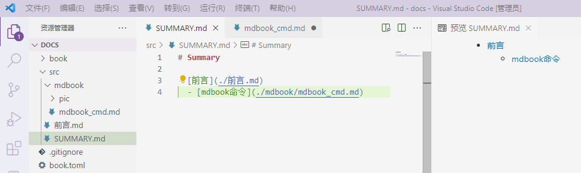

# mdbook命令
mdbook的主要命令就是初始工程和启动服务。
## init
```shell
> mdbook init -h
mdbook.exe-init v0.4.21
Creates the boilerplate structure and files for a new book

USAGE:
    mdbook.exe init [OPTIONS] [dir]

ARGS:
    <dir>    Directory to create the book in
             (Defaults to the Current Directory when omitted)

OPTIONS:
        --force              Skips confirmation prompts
    -h, --help               Print help information
        --ignore <ignore>    Creates a VCS ignore file (i.e. .gitignore) [possible values: none,
                             git]
        --theme              Copies the default theme into your source folder
        --title <title>      Sets the book title
    -V, --version            Print version information
  
```
## serve
```shell
> mdbook serve -h
mdbook.exe-serve v0.4.21
Serves a book at http://localhost:3000, and rebuilds it on changes

USAGE:
    mdbook.exe serve [OPTIONS] [dir]

ARGS:
    <dir>    Root directory for the book
             (Defaults to the Current Directory when omitted)

OPTIONS:
    -d, --dest-dir <dest-dir>    Output directory for the book
                                 Relative paths are interpreted relative to the book's root
                                 directory.
                                 If omitted, mdBook uses build.build-dir from book.toml or defaults
                                 to `./book`.
    -h, --help                   Print help information
    -n, --hostname <hostname>    Hostname to listen on for HTTP connections [default: localhost]
    -o, --open                   Opens the compiled book in a web browser
    -p, --port <port>            Port to use for HTTP connections [default: 3000]
    -V, --version                Print version information
```
1.初始化工程
 ```shell
mkdir docs && cd docs
mdbook init . --title "my book"
 ```

2.启用服务,默认端口是3000，--open会自动打开默认浏览器。
```shell
mdbook serve . --open
```
3.现在可以通过在编辑src下的SUMMARY.md中新增章节，新增条目后，会自动创建文件,同时更新网页目录。

<center>
    
    <br>
    <div style="color:orange; border-bottom: 1px solid #d9d9d9;
    display: inline-block;
    color: #999;
    padding: 2px;">文件布局</div>
</center>

serve自动将markdown渲染输出到book目录，因此`.gitignore`文件的book，表示忽略book目录内的修改，防止触发build。


>参考：https://rust-lang.github.io/mdBook/index.html
